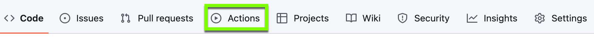
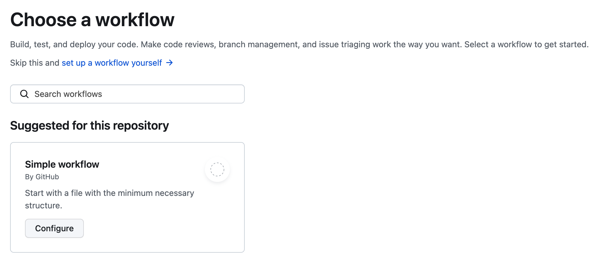

# GitHub-Actions-Playground

This repository is used to test GitHub Actions.

## Files and Resources

The GitHub Actions workflows are stored in the [.github/workflows](.github/workflows/) directory.

Documentation for GitHub Actions can be found [here](https://docs.github.com/en/actions).

You can initiate a GitHub Action by clicking on "Actions" on the "Home" page of a repository.

After clicking on "Actions", you will be asked to choose a workflow, or you can click "set up a workflow yourself".

Alternatively, you can create a `.github/workflows` directory, and add your workflow to the `workflows` folder.

##  Workflow for linting Python files

In the [.github/workflows](.github/workflows/) directory you will find the `python-linting.yml` [file](.github/workflows/python-linting.yml). This file will perform linting on all the files Python files that have been changed on the PR using flake8.

A detailed explanation of the workflow steps in the `python-linting.yml` can be found [here](Python_Linting.md).

## Workflow for Testing Python files

Coming soon!

## Workflow for Testing Jupyter notebook files

Coming soon!
